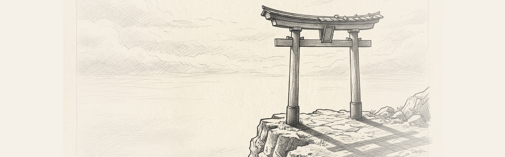

# Meta WebXR Skills for Claude Code



Skills for building WebXR PWA experiences targeting Meta Quest devices. Covers the full stack from PWA installability to MR passthrough, spatial anchors, and the WebXR Layers API.

Modelled on [threejs-skills](../threejs-skills/). Sourced from:
- [immersive-web/webxr-samples](https://github.com/immersive-web/webxr-samples)
- [meta-quest/webxr-first-steps](https://github.com/meta-quest/webxr-first-steps)
- [meta-quest/reality-accelerator-toolkit](https://github.com/meta-quest/reality-accelerator-toolkit)
- [meta-quest/webxr-showcases](https://github.com/meta-quest/webxr-showcases)
- [meta-quest/bubblewrap](https://github.com/meta-quest/bubblewrap)
- Meta Horizon Developer Documentation

## Skills

| Skill | Load when... |
|-------|-------------|
| **webxr-session** | Setting up XR sessions, checking device support, requesting features, handling session events |
| **webxr-rendering** | XR render loop, reference spaces, XRFrame, stereo views, Three.js WebXRManager |
| **webxr-pwa-quest** | PWA manifest for Quest, service worker, `ovr_*` extensions, Horizon Store packaging |
| **webxr-input** | Controllers, hand tracking, gamepad buttons/axes, haptics, Three.js controller models |
| **webxr-passthrough** | Quest MR passthrough, plane/mesh detection, `immersive-ar` session, transparent renderer |
| **webxr-ratk** | Reality Accelerator Toolkit — Three.js abstractions for planes, meshes, anchors, hit-testing |
| **webxr-anchors** | Spatial anchors, hit-testing, anchor persistence across sessions |
| **webxr-layers** | WebXR Layers API — Quad, Cylinder, Equirect, Cube, Projection layers |

## Dependency Map

```
webxr-pwa-quest ─────────────────────────────────────► webxr-session
                                                              │
                              ┌───────────────────────────────┘
                              ▼
                        webxr-rendering
                              │
               ┌──────────────┼──────────────┐
               ▼              ▼              ▼
          webxr-input   webxr-layers   webxr-passthrough
                                             │
                                    ┌────────┘
                                    ▼
                               webxr-ratk
                                    │
                                    ▼
                              webxr-anchors
```

## Key Quest-Specific Rules

1. **`requestSession` must be synchronous** inside a user gesture — no async gap allowed.
2. **`display: standalone`** in manifest — `fullscreen` breaks PWA installability.
3. **`alpha: true`** renderer for passthrough — `scene.background = null`.
4. **`fixedFoveation = 1.0`** for VR performance; `foveation(0)` for MR quality.
5. **`local-floor`** reference space for standing — not `local`.
6. **`hand !== null`** check before using joints — hands disappear when occluded.
7. **`ratk.update()`** must be inside `renderer.setAnimationLoop` — not `window.requestAnimationFrame`.
8. **`ovr_package_name`** format: reverse-domain (`in.walkinto.vr`).
